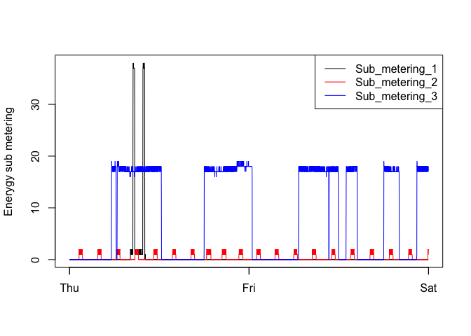

Exploratory Data Analysis Project 1 Codebook
================
Michael G Harpole
2023-01-28

# Plot 1

This plot is a histogram which shows the global active power in
kilowats. Components of the histogram:

- color of the bins are red.
- y axis label is frequency.
- x axis label is Global Active Power (kilowats).
- main title is Global Active Power

``` r
myFiles <- list.files(pattern="*.txt")
myFiles
```

    ## [1] "household_power_consumption.txt"

``` r
myData <- read_delim(myFiles[1],na="?",show_col_types = FALSE) %>% 
  mutate(Date=lubridate::dmy(Date)) %>% 
  filter(between(Date, as.Date('2007-02-01'), as.Date('2007-02-02')))
# only want dates between 2007-02-01 and 2007-02-02
summary(myData)
```

    ##       Date                Time          Global_active_power
    ##  Min.   :2007-02-01   Length:2880       Min.   :0.220      
    ##  1st Qu.:2007-02-01   Class1:hms        1st Qu.:0.320      
    ##  Median :2007-02-01   Class2:difftime   Median :1.060      
    ##  Mean   :2007-02-01   Mode  :numeric    Mean   :1.213      
    ##  3rd Qu.:2007-02-02                     3rd Qu.:1.688      
    ##  Max.   :2007-02-02                     Max.   :7.482      
    ##  Global_reactive_power    Voltage      Global_intensity Sub_metering_1   
    ##  Min.   :0.0000        Min.   :233.1   Min.   : 1.000   Min.   : 0.0000  
    ##  1st Qu.:0.0000        1st Qu.:238.4   1st Qu.: 1.400   1st Qu.: 0.0000  
    ##  Median :0.1040        Median :240.6   Median : 4.600   Median : 0.0000  
    ##  Mean   :0.1006        Mean   :240.4   Mean   : 5.102   Mean   : 0.4062  
    ##  3rd Qu.:0.1440        3rd Qu.:242.4   3rd Qu.: 7.000   3rd Qu.: 0.0000  
    ##  Max.   :0.5000        Max.   :246.6   Max.   :32.000   Max.   :38.0000  
    ##  Sub_metering_2   Sub_metering_3  
    ##  Min.   :0.0000   Min.   : 0.000  
    ##  1st Qu.:0.0000   1st Qu.: 0.000  
    ##  Median :0.0000   Median : 0.000  
    ##  Mean   :0.2576   Mean   : 8.501  
    ##  3rd Qu.:0.0000   3rd Qu.:17.000  
    ##  Max.   :2.0000   Max.   :19.000

``` r
head(myData)
```

    ## # A tibble: 6 × 9
    ##   Date       Time   Global_act…¹ Globa…² Voltage Globa…³ Sub_m…⁴ Sub_m…⁵ Sub_m…⁶
    ##   <date>     <time>        <dbl>   <dbl>   <dbl>   <dbl>   <dbl>   <dbl>   <dbl>
    ## 1 2007-02-01 00'00"        0.326   0.128    243.     1.4       0       0       0
    ## 2 2007-02-01 01'00"        0.326   0.13     243.     1.4       0       0       0
    ## 3 2007-02-01 02'00"        0.324   0.132    244.     1.4       0       0       0
    ## 4 2007-02-01 03'00"        0.324   0.134    244.     1.4       0       0       0
    ## 5 2007-02-01 04'00"        0.322   0.13     243.     1.4       0       0       0
    ## 6 2007-02-01 05'00"        0.32    0.126    242.     1.4       0       0       0
    ## # … with abbreviated variable names ¹​Global_active_power,
    ## #   ²​Global_reactive_power, ³​Global_intensity, ⁴​Sub_metering_1,
    ## #   ⁵​Sub_metering_2, ⁶​Sub_metering_3

``` r
names(myData)
```

    ## [1] "Date"                  "Time"                  "Global_active_power"  
    ## [4] "Global_reactive_power" "Voltage"               "Global_intensity"     
    ## [7] "Sub_metering_1"        "Sub_metering_2"        "Sub_metering_3"

``` r
hist(myData$Global_active_power,col = "red",
     xlab = "Global Active Power (kilowats)",
     main="Global Active Power")
```

<!-- -->

``` r
dev.copy(png,"plot1.png")
```

    ## quartz_off_screen 
    ##                 3

``` r
dev.off()
```

    ## quartz_off_screen 
    ##                 2

# Plot 2

This plot is a line graph showing global active power across 3 days. The
graph componenets are:

- y label is Global Active Power (kilowats).
- x label is days of the week
- no main title

``` r
myFiles <- list.files(pattern="*.txt")
myFiles
```

    ## [1] "household_power_consumption.txt"

``` r
myData <- read_delim(myFiles[1],na=c("?"),show_col_types = FALSE) %>% 
  mutate(Date=lubridate::dmy(Date)) %>% 
  filter(between(Date, as.Date('2007-02-01'), as.Date('2007-02-02'))) %>% 
  mutate(DateTime = lubridate::ymd_hms(paste(myData$Date,myData$Time)) )

plot(myData$DateTime,
     myData$Global_active_power,
     type = "l",
     xlab = "",
     ylab = "Global Active Power (kilowats)")
```

<!-- -->

``` r
dev.copy(png,"plot2.png")
```

    ## quartz_off_screen 
    ##                 3

``` r
dev.off()
```

    ## quartz_off_screen 
    ##                 2

# Plot 3

This is a multivariable graph showing energy sub_meeting across time
Components of graph:

- y label Energy sub metering
- x no label
- black line with sub_metering_1
- red line with sub_metering_3
- blue line with sub_metering_3
- legend with three sub headings and corresponding colors

``` r
myData <- read_delim("household_power_consumption.txt",
                     na=c("?"),
                     show_col_types = FALSE) %>% 
  mutate(Date=lubridate::dmy(Date)) %>% 
  filter(between(Date, as.Date('2007-02-01'), as.Date('2007-02-02'))) %>% 
  mutate(DateTime = lubridate::ymd_hms(paste(myData$Date,myData$Time)) )

plot(myData$DateTime,
     myData$Sub_metering_1,
     type = "l",
     xlab = "",
     ylab = "Enerygy sub metering")
lines(myData$DateTime,
     myData$Sub_metering_2,
     col="red")
lines(myData$DateTime,
      myData$Sub_metering_3,
      col="blue")
legend("topright",
       lty = c(1,1,1),
       col = c("black","red","blue"),
       legend=c("Sub_metering_1","Sub_metering_2","Sub_metering_3"))
```

<!-- -->

``` r
dev.copy(png,"plot3.png")
```

    ## quartz_off_screen 
    ##                 3

``` r
dev.off()
```

    ## quartz_off_screen 
    ##                 2
